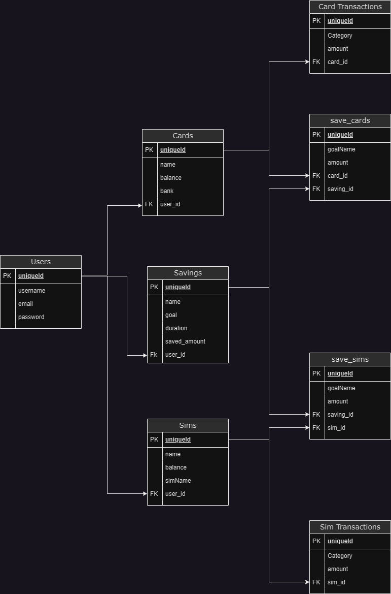

# [POCKETS(backend)](https://ai-hub-1.vercel.app/)

The API to [Pockets](https://pocketswatch.vercel.app/)

## Table of Contents

1. [Getting started](#Getting-started)
2. [Usage](#Usage)
3. [Relationships](#relations)
3. [Models](#Methods)
   - [Users](#user)
   - [Cards](#card)
   - [Sim](#sim)
   - [Saving](#saving)
   - [Card savings](#save_cards)
   - [Sim savings](#save_sims)
4. [Contributors](#contributors)
5. [Licenses](#license)
6. [Sources](#Sources)

## <a id="Getting-started">Getting started</a>

The project can be accessed in 2 ways:

### 1. Website

You can access the site here - [AI Hub](https://ai-hub-1.vercel.app/)

### 2. Cloning

**Clone** the project files to your local repository:

- HTTPS => `https://github.com/edd-ie/AI-Hub.git`
- SSH => `git@github.com:edd-ie/AI-Hub.git`
- Git CLI => `gh repo clone edd-ie/AI-Hub`

Open the terminal and install all dependencies using.

```
npm install
```

In the terminal run this command to start the react app (accept the assigning of a new port if prompted)

```
npm start
```

Your default browser will be launched and the homepage will be rendered.


## <a id="Usage">Usage</a>

The homepage has a simple UI that allows for the user to navigate.

User can navigate to by either click the names on the navbar or relevant icon on the left side of the page

## <a id="Relationships">Relationships</a>


## <a id="Methods">Models</a>

Each page uses a specific AI model to do a specialized task.

### <a id="users">User</a>


### <a id="card">Card</a>

### <a id="sim">Sim</a>

### <a id="saving">Saving</a>

### <a id="save_cards">Card savings</a>

### <a id="save_sims">Sim savings</a>


## <a id="contributors">Contributors</a>

This project was a team effort from the following individuals :

- [Edd.ie](https://github.com/edd-ie)
- [Glory](https://github.com/Nkathaglow)
- [Austin](https://github.com/Naulikha)

## <a id="license">Licenses</a>

The project is licensed under the [BSD 3-Clause "New" or "Revised" License](https://github.com/highlightjs/highlight.js/blob/main/LICENSE), thus redistribution and use in source and binary forms are permitted provided that the conditions are met


